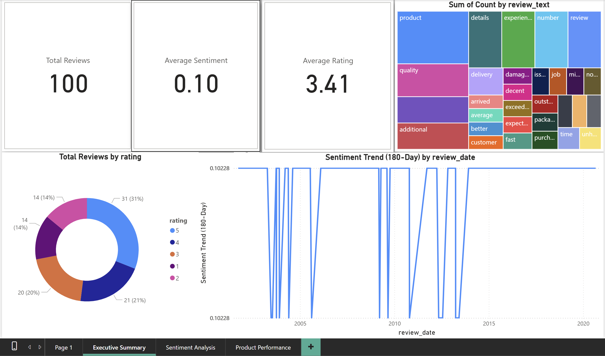
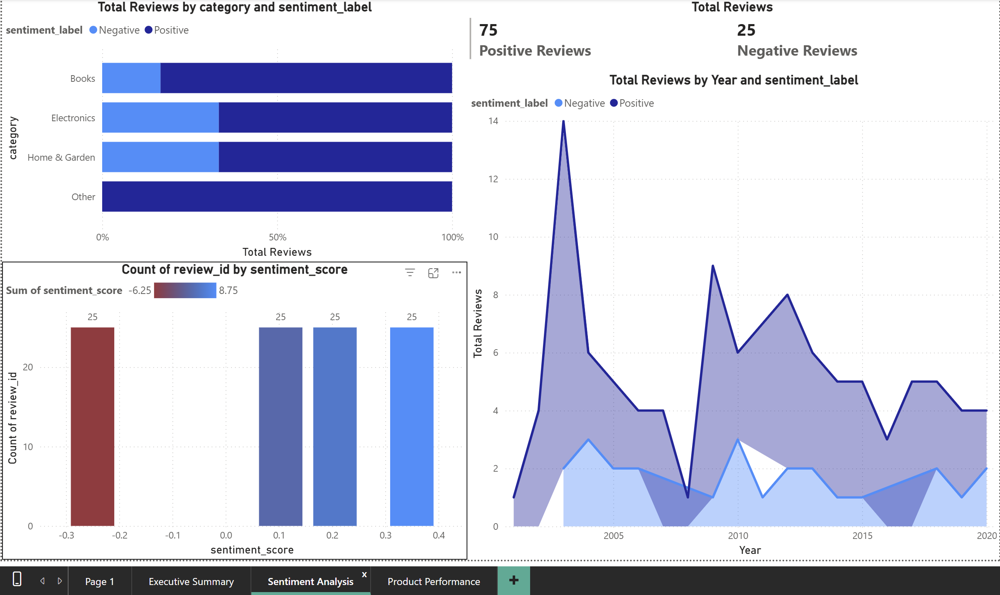
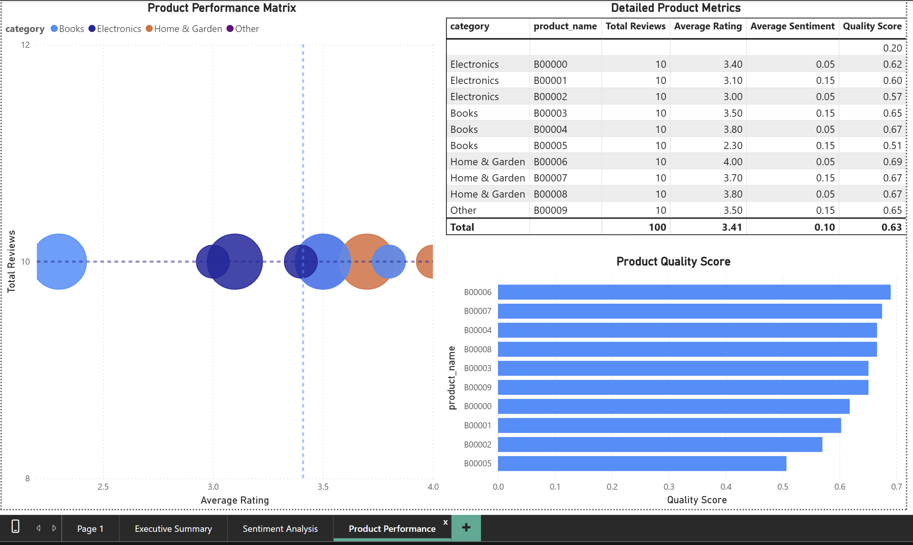
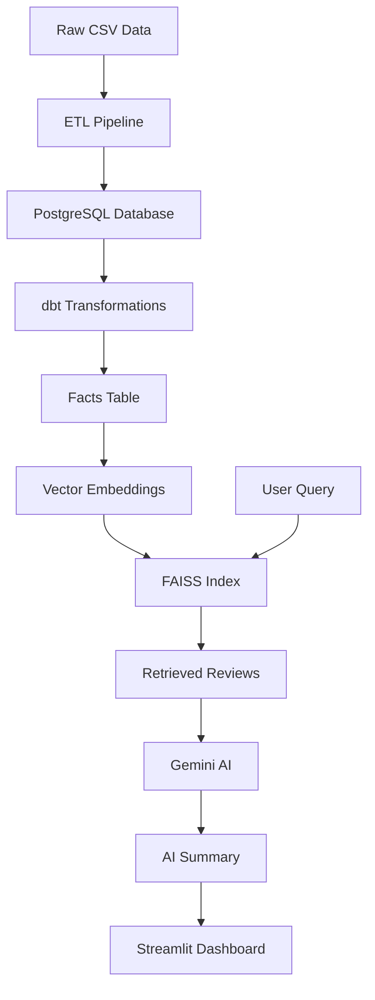

# 🤖 AI-Powered Customer Feedback Analytics Platform

[](https://www.python.org/downloads/)
[](https://opensource.org/licenses/MIT)
[](https://streamlit.io)
[](https://postgresql.org)
[](https://ai.google.dev)

> Transform thousands of customer reviews into actionable business insights in seconds using advanced RAG (Retrieval-Augmented Generation) and Large Language Models.

## 📸 Power BI 

## Executive Summary


## Sentiment Analysis


## Product Performance


---

## 🎯 Project Overview

This platform revolutionizes how businesses understand customer feedback by combining modern data engineering with cutting-edge AI. Instead of manually reading thousands of reviews, stakeholders can ask natural language questions and receive instant, accurate summaries powered by semantic search and LLMs.

### ✨ Key Features

- 🔍 **Semantic Search**: Uses sentence transformers to understand context and meaning
- 🤖 **AI-Powered Summaries**: Gemini AI generates human-readable insights
- 📊 **Real-time Analytics**: Interactive dashboards with sentiment analysis
- 🏗️ **Robust Data Pipeline**: dbt-powered ETL ensures data quality
- 🎨 **Modern UI**: Beautiful, responsive interface built with Streamlit
- ⚡ **Lightning Fast**: FAISS vector search for millisecond query responses

---

## 🏗️ Architecture



## 🛠️ Tech Stack

| Category | Technology | Purpose |
|----------|------------|---------|
| **Frontend** | Streamlit | Interactive web interface |
| **Backend** | Python, FastAPI | API and business logic |
| **Database** | PostgreSQL | Data storage and querying |
| **ETL** | dbt, Pandas | Data transformation pipeline |
| **AI/ML** | Sentence Transformers, FAISS | Semantic search and embeddings |
| **LLM** | Google Gemini API | Text generation and summarization |
| **Visualization** | Plotly, Power BI | Charts and business intelligence |

---

## 🚀 Quick Start Guide

### Prerequisites
- Python 3.9+
- PostgreSQL 12+
- Google AI API key (free tier available)

### 1. Clone & Setup
```bash
git clone https://github.com/yourusername/customer-feedback-analytics.git
cd customer-feedback-analytics

# Create virtual environment
python -m venv venv
source venv/bin/activate  # On Windows: venv\Scripts\activate

# Install dependencies
pip install -r requirements.txt
```

### 2. Configure Environment
Create a `.env` file in the project root:
```env
# Database Configuration
DB_USER=postgres
DB_PASS=your_password
DB_HOST=localhost
DB_PORT=5432
DB_NAME=feedback_db

# Google Gemini API Key (Get from https://aistudio.google.com/app/apikey)
GEMINI_API_KEY=your_gemini_api_key_here
```

### 3. Run ETL Pipeline
```bash
# Load and process your data
python src/etl_pipeline.py
```

### 4. Launch the App
```bash
streamlit run streamlit_app/app.py
```

Navigate to `http://localhost:8501` and start asking questions! 🎉

---

## 💡 Example Queries

Try these questions to explore your customer feedback:

| Query Type | Example Questions |
|------------|------------------|
| **Product Issues** | "What are the main complaints about battery life?" |
| **Service Quality** | "How do customers feel about delivery speed?" |
| **Feature Feedback** | "What features do customers love most?" |
| **Sentiment Analysis** | "Summarize the negative feedback from this month" |
| **Comparisons** | "Compare reviews for iPhone vs Samsung products" |

---

## 📁 Project Structure

```
customer-feedback-analytics/
│
├── 📂 data/                      # Raw datasets
│   └── Reviews.csv               # Customer review data
│
├── 📂 src/                       # Core Python modules
│   ├── etl_pipeline.py          # Data extraction & loading
│   └── rag_engine.py            # RAG implementation
│
├── 📂 streamlit_app/             # Web application
│   └── app.py                   # Main Streamlit interface
│
├── 📂 dbt_project/               # Data transformations
│   └── models/
│       ├── staging_reviews.sql  # Data cleaning
│       └── facts_reviews.sql    # Analytics-ready data
│
├── 📂 notebooks/                 # Jupyter notebooks for analysis
├── 📂 dashboard/                 # Power BI files
├── .env                         # Environment variables
├── requirements.txt             # Python dependencies
└── README.md                    # This file
```

---

## 📊 Features Deep Dive

### 🔍 Retrieval-Augmented Generation (RAG)
Our RAG system combines:
- **Semantic Embeddings**: Convert text to 384-dimensional vectors
- **FAISS Vector Database**: Lightning-fast similarity search
- **Context-Aware Retrieval**: Find reviews that actually answer your question
- **LLM Integration**: Generate human-readable summaries from retrieved context

### 📈 Analytics Dashboard
- **Sentiment Trends**: Track customer satisfaction over time
- **Rating Analysis**: Visualize score distributions
- **Query History**: Review past analyses
- **Export Capabilities**: Save insights as reports

### 🏗️ Data Pipeline
- **Automated ETL**: Process new reviews automatically
- **Data Quality**: Built-in validation and cleaning
- **Scalable Architecture**: Handle millions of reviews
- **Version Control**: Track data lineage with dbt

---

## 🎛️ Configuration Options

### Database Settings
```python
# Custom database configuration
DB_CONNECTION_PARAMS = {
    'pool_size': 10,
    'max_overflow': 20,
    'pool_timeout': 30
}
```

### AI Model Settings
```python
# Customize retrieval parameters
RAG_CONFIG = {
    'embedding_model': 'all-MiniLM-L6-v2',  # Fast, efficient
    'top_k_results': 5,                     # Number of reviews to analyze
    'similarity_threshold': 0.7,            # Minimum relevance score
    'max_tokens': 500                       # Summary length limit
}
```

---

## 🧪 Sample Datasets

The project works with any customer review dataset. Here are some examples:

| Dataset | Size | Description |
|---------|------|-------------|
| **Amazon Reviews** | 500K+ | Product reviews across categories |
| **Yelp Reviews** | 1M+ | Restaurant and service reviews |
| **App Store Reviews** | 100K+ | Mobile app feedback |
| **Custom Data** | Any | Your own CSV files |

### Data Format
Your CSV should include these columns:
```csv
Id,ProductId,UserId,Score,Text,Time
1,B001,U001,5,"Great product, fast delivery",1640995200
2,B001,U002,3,"Good but expensive",1640995300
```

---

## 🚀 Deployment Options

### Local Development
```bash
streamlit run streamlit_app/app.py
```

### Docker Deployment
```dockerfile
FROM python:3.9-slim
COPY . /app
WORKDIR /app
RUN pip install -r requirements.txt
EXPOSE 8501
CMD ["streamlit", "run", "streamlit_app/app.py"]
```

### Cloud Deployment
- **Streamlit Cloud**: One-click deployment
- **Heroku**: Web app hosting
- **AWS/GCP**: Full-scale production deployment

---

## 🤝 Contributing

We welcome contributions! Here's how to get started:

1. **Fork the repository**
2. **Create a feature branch**: `git checkout -b feature/amazing-feature`
3. **Commit changes**: `git commit -m 'Add amazing feature'`
4. **Push to branch**: `git push origin feature/amazing-feature`
5. **Open a Pull Request**

### Development Setup
```bash
# Install development dependencies
pip install -r requirements-dev.txt

# Run tests
pytest tests/

# Format code
black src/ streamlit_app/

# Lint code
flake8 src/ streamlit_app/
```

---

## 📄 License

This project is licensed under the MIT License - see the [LICENSE](LICENSE) file for details.

---

## 🙏 Acknowledgments

- **Hugging Face** - For excellent transformer models
- **Google AI** - For Gemini API access
- **Streamlit Team** - For the amazing web framework
- **dbt Labs** - For data transformation tools

---

## 📞 Support & Contact

- **Issues**: [GitHub Issues](https://github.com/yourusername/customer-feedback-analytics/issues)
- **Discussions**: [GitHub Discussions](https://github.com/yourusername/customer-feedback-analytics/discussions)
- **Email**: your.email@example.com
- **LinkedIn**: [Your LinkedIn Profile](https://linkedin.com/in/yourprofile)

---

<div align="center">
  <h3>⭐ If this project helped you, please star it on GitHub! ⭐</h3>
  
  [⚡ Live Demo](https://your-demo-link.streamlit.app) • 
  [📖 Documentation](https://github.com/yourusername/customer-feedback-analytics/wiki) • 
  [🐛 Report Bug](https://github.com/yourusername/customer-feedback-analytics/issues) • 
  [💡 Request Feature](https://github.com/yourusername/customer-feedback-analytics/issues)

</div>

